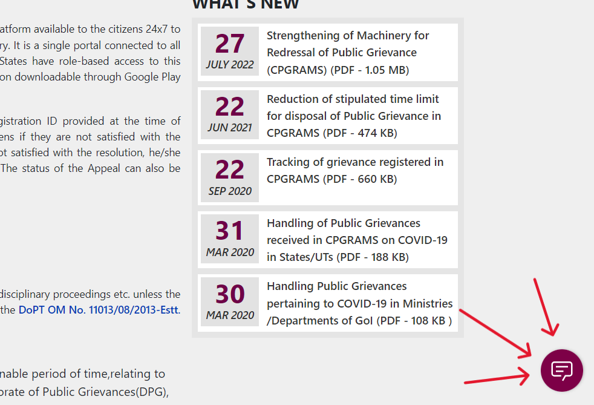

# Dukhanta: Department of Administrative Reforms and Public Grievance Virtual Assistant

Dukhanta is a virtual assistant developed for the Department of Administrative Reforms and Public Grievance (DARPG) to assist users in clearing doubts regarding filing complaints or grievances. It is built using IBM's Watson Assistant technology.

## Features

- **User Assistance:** Dukhanta provides guidance and assistance to users in understanding the process of filing complaints or grievances with the DARPG.
  
- **Real-time Support:** The virtual assistant is capable of accommodating up to 1000 live users at a time, ensuring efficient and timely support to users.
  
- **Decoy Website Hosting:** Currently, Dukhanta is hosted on a decoy website for testing and development purposes. The hosting environment ensures the security and integrity of the system while allowing for seamless interaction with users.

- **Accuracy and Reliability:** Dukhanta is designed to provide pretty accurate replies to user queries and does not stop with errors at any given juncture. It employs advanced algorithms to understand user input and deliver appropriate responses, enhancing user satisfaction and trust in the system.

## Limitations

- **Backend Integration:** The responses for certain queries related to department domains like agriculture, finance, etc., are not available to us due to limitations in accessing backend systems. As a result, Dukhanta may not be able to provide comprehensive information on all topics.

## Usage

1. **Accessing Dukhanta:** Users can access Dukhanta through the DARPG website or directly via the hosted decoy website.
  
2. **Asking Queries:** Users can ask Dukhanta questions related to filing complaints or grievances with the DARPG. Dukhanta will provide relevant information and guidance based on its knowledge base.

3. **Feedback:** Users are encouraged to provide feedback on their experience with Dukhanta. This feedback helps us improve the virtual assistant and enhance user satisfaction.

4. **Running DARPG.html:** Users can directly run DARPG.html to interact with the assistant as it has already been embedded in it.

## Images

## Team Members

- Surya Prabhakaran
- Koushik N
- Prajen S K

## Future Enhancements

- **Backend Integration:** Efforts are underway to integrate Dukhanta with backend systems to access information related to department domains, thereby enhancing its capabilities.
  
- **Expanded Knowledge Base:** We are continuously updating Dukhanta's knowledge base to include a broader range of topics and improve the accuracy of responses.

## Contact Information

For any inquiries or feedback regarding Dukhanta, please contact:

Prithvi Ragavendiran R @prithviragavendiranr.eee2022@citchennai.net

## Disclaimer

Dukhanta is a virtual assistant developed for informational purposes and is not intended to replace official channels yet for filing complaints or grievances. Users are advised to refer to the official DARPG website or contact relevant authorities for official assistance.
